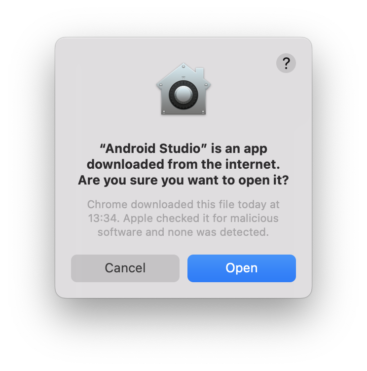
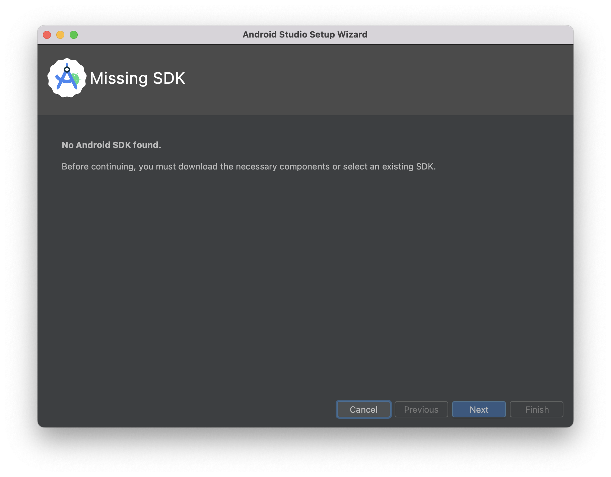
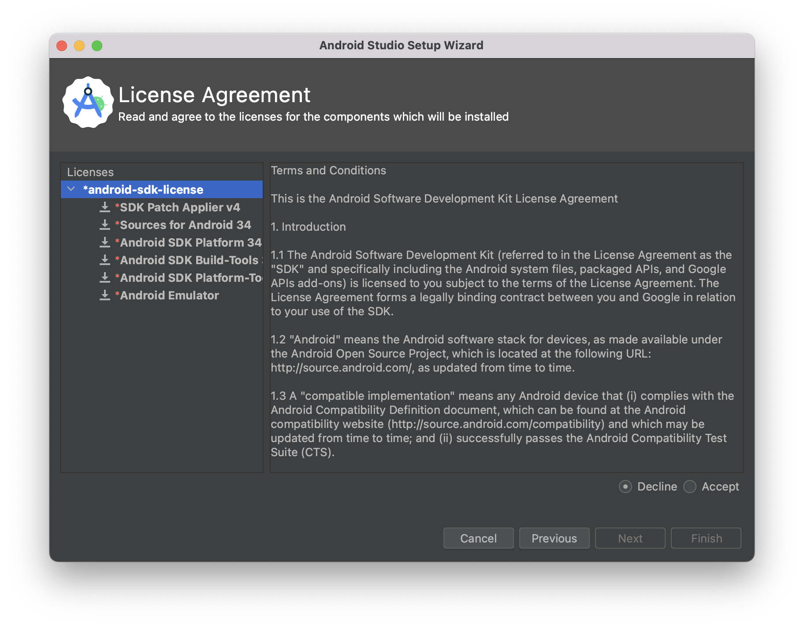
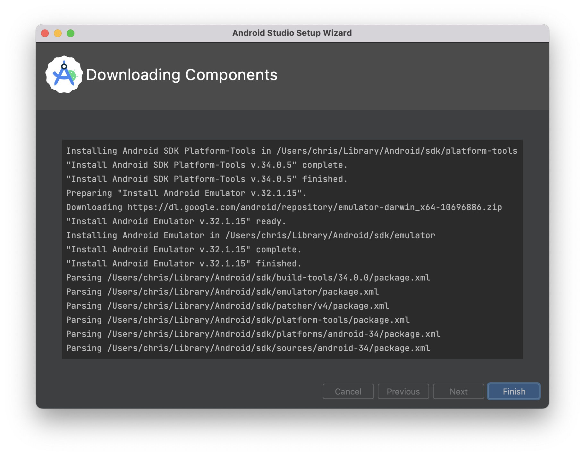
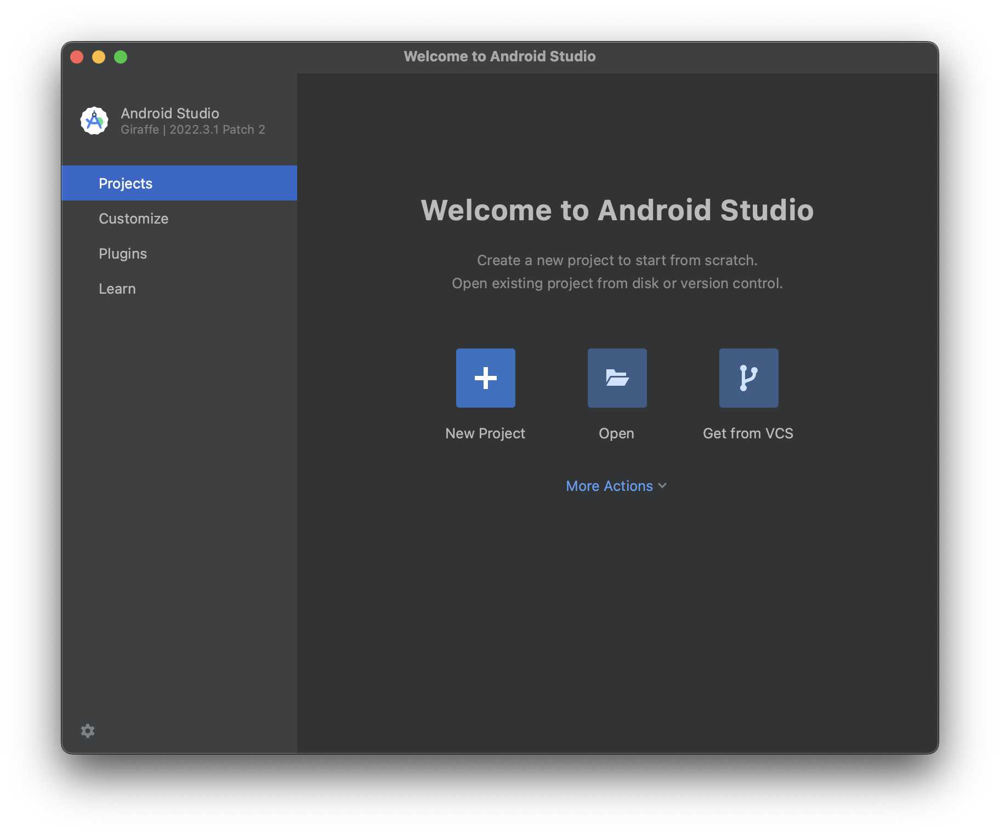

# How To - Required software

## Introduction

This guide shows you how to setup a Mac for Android development.

## Android studio

Head over to the [Android Developer website](https://developer.android.com/studio) and download the latest version of Android studio.

You'll need to accept the terms and conditions, and select the appropriate version of Android Studio for the Mac you're working on.

> ``ℹ️`` Check out the [how to on finding which chip your Mac is using](./whichChip.md)

Once the download is complete locate the `.dmg` file and open it. You will be presented with the following dialog:

Drag the Android Studio icon into the Applications icon. Double-click the Applications icon, then double-click the Android Studio icon from the applications window.

You may be shown Apple's malicious software dialog; click `Open`

Android Studio should launch to its splash screen, followed by a prompt to install the Android SDK

Hit `Next` to continue to the SDK selection screen

Leave the default selection and click `Next`

Click `Next` in the Verify Settings screen

Leave the `android-sdk-license` root node selected, select the `Accept` radio button, then click `Next`.

The download of components will start 

Once the download is complete click `Finish` and you're done!

You're Android Studio installation and setup is now complete. Next we'll move on to getting the Git repository cloned and opened in the IDE.
